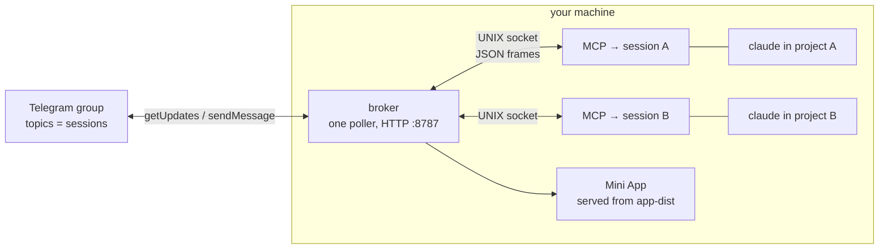

# cc-tg-hub — Telegram Mini App for multiple Claude Code sessions

Each Claude Code session becomes a forum topic you chat with from your phone. One shared bot, one broker (the sole Telegram poller), one MCP per session. Starting a new session never kills the old one.

- [How it works](#how-it-works) — the full flow, end to end
- [Setup](#setup) · [Upgrading](#upgrading) · [Mini App](#optional-mini-app-session-management-ui) · [Troubleshooting](#troubleshooting)

## How it works

Three kinds of process, and a UNIX socket between them.

| | what it is | how many | lifetime |
|---|---|---|---|
| **broker** | the only thing that talks to Telegram: long-polls `getUpdates`, owns the bot token, creates topics, sends messages | exactly one | detached daemon, survives every session |
| **MCP** | an MCP server `claude` spawns inside each session; bridges that session to the broker | one per session | dies with its session |
| **Mini App** | optional React SPA for managing sessions, served by the broker over HTTP | zero or one | optional |

The broker and MCP speak line-delimited JSON frames over `~/.claude/cc-tg-hub/broker.sock` (see `shared/src/frames.ts`). MCP → broker: `register`, `reply`, `unregister`. Broker → MCP: `registered`, `message`, `stop`.



### Starting a session

Run `claude` anywhere. It reads `~/.claude.json`, spawns the cc-tg-hub MCP, and the MCP connects to the broker's socket — spawning the broker itself, detached, if nothing is listening. The MCP then sends `register` with its session id, the directory name, and the cwd.

The broker looks for an existing topic whose `(name, cwd)` matches, so reopening a project lands back in its old topic with its history intact. If there's no match it calls `createForumTopic`. Either way it answers `registered` with the topic id, and the session is live.

### Telegram → your session (inbound)

1. The broker's poll loop returns an update.
2. `isAllowed(from.id)` rejects anyone not in `allowUserIds` — the trust boundary.
3. `message_thread_id` identifies the topic; messages outside a topic are ignored.
4. The topic maps to a session record. No live record, or the socket is gone, and the message is dropped (the record gets corrected to offline).
5. A paused session drops the message here, before any side effect.
6. Photos are downloaded to `inbox/` and passed as `image_path`; documents pass through as a `file_id`.
7. The broker writes a `message` frame to that session's socket.
8. The MCP emits a `notifications/claude/channel` notification, which the host renders in the session as `<channel source="telegram" chat_id="…" …>`.

Step 8 is the fragile one, and it needs the channels flag — see [Setup](#setup) step 3. The host's schema requires `content` and **every** value in `meta` to be a string; anything else throws inside its notification handler and takes down the whole MCP connection, which looks exactly like "Telegram is broken."

### Your session → Telegram (outbound)

Claude calls the `reply` tool with the `chat_id` from the inbound block. The MCP sends a `reply` frame; the broker resolves the session's topic and calls `sendMessage` there, followed by `sendPhoto` for any `files`. Transcript output never reaches Telegram — only the `reply` tool does.

### Session lifecycle

Records live in `sessions.json` and carry one of five states, four stored and one derived:

- **online** — socket connected, seen recently.
- **idle** — derived, not stored: online but quiet for longer than `idleMs`.
- **paused** — inbound is dropped on arrival; outbound still works. Toggled from the Mini App.
- **offline** — the socket closed. Set when the session exits, when a close event fires, or when the broker restarts (socket ids are per-process, so every `online` record is demoted on load).
- **stopped** — terminal. `stop` tells the MCP to disconnect, and the record is kept as a tombstone so a late reconnect can't resurrect it.

### What lives on disk

```
~/.claude/cc-tg-hub/
├── cli.js          the self-contained bundle the broker AND every MCP execute
├── config.json     bot token, group id, allowlist            (0600)
├── broker.pid      the winning broker's pid
├── broker.sock     the UNIX socket                            (0600)
├── sessions.json   one record per session
├── inbox/          photos downloaded from Telegram
├── app-dist/       the built Mini App, if you installed it
└── logs/
    ├── broker.err.log   broker stderr, including [trace] routing lines
    └── mcp.log          every MCP's inbound + delivery log
```

`cli.js` is the important one: it is a **copy**, refreshed only by `setup`. See [Upgrading](#upgrading).

## Setup

1. **Telegram, one-time (~2 min, manual):** In [@BotFather](https://t.me/BotFather) run `/newbot` and save the token. Create a supergroup, enable **Topics** in its settings, and add the bot as an admin with **Manage Topics** permission.

2. **Install + configure (one command):**
   ```sh
   bunx cc-tg-hub setup
   ```
   Paste the bot token when prompted, then send any message (e.g. `/start`) in your group. setup detects the group and your user id from that message, writes `~/.claude/cc-tg-hub/config.json`, and wires the MCP into `~/.claude.json` globally — so every `claude` session gets it with no per-project config. It also pre-allows `mcp__cc-tg-hub__reply` in `~/.claude/settings.json` so unattended sessions can reply without a permission prompt; sessions installed before this change need one manual "Yes, and don't ask again" approval on the first reply.

3. **Use:** Launch sessions with the channels flag — an Anthropic research-preview feature (claude ≥ 2.x, requires claude.ai/Console auth, not Bedrock/Vertex) that inbound Telegram messages depend on entirely:
   ```sh
   claude --dangerously-load-development-channels server:cc-tg-hub
   ```
   Alias it: `alias claude-tg='claude --dangerously-load-development-channels server:cc-tg-hub'`. **Accept the "Loading development channels" warning at launch** (Enter) — without that the channel never attaches and inbound is silently dropped. Verify with `/status`: it should read `Channels: Listening for messages from server:cc-tg-hub`. A forum topic appears in your group; message it from your phone and Claude replies via the `reply` tool.

   > **Known upstream limitation (Claude Code ≤ 2.1.220):** channel messages only render in **fresh** conversations. In a resumed conversation (`--continue`, `--resume`, or the in-app resume picker) the host receives the notifications but silently drops them — verified with a minimal repro. Start a new conversation when you need the Telegram bridge.

The broker starts itself the first time you open `claude` (the MCP it spawns brings it up as a detached background process) and stays up across sessions. You never start or manage it by hand. If you need to: `cc-tg-hub status` / `cc-tg-hub stop` / `cc-tg-hub logs` / `cc-tg-hub uninstall`.

> No bot token? The setup step is the only place secrets are needed — the token, group id, and your user id all flow from that one paste + one message.

## Upgrading

Installing the new package is **not** enough. The broker and the MCP both execute `~/.claude/cc-tg-hub/cli.js` — a self-contained copy of the bundle that only `setup` refreshes:

```sh
bunx cc-tg-hub@latest setup
```

It stops the running broker, re-copies the bundle, and re-detects your group, so have the bot token to hand and send one message in the group again, exactly as on a first install. Sessions that are already open keep the old MCP until you restart them.

## Optional: Mini App (session management UI)

Chatting with your sessions needs no Mini App. The Mini App adds a management surface — list every session with its status, rename, pause/resume inbound, and stop — served by the broker's HTTP API on `httpPort` (default 8787).

**1. Get a build.** Either build it (`bun run app:build`, output in `app/dist`) or download the `app-dist` assets attached to any [release](https://github.com/rennf93/cc-tg-hub/releases).

**2. Install it** where the broker looks, then restart the broker so it picks the directory up — the static handler is only wired at startup, and only if the directory exists:

```sh
cp -R app/dist ~/.claude/cc-tg-hub/app-dist
cc-tg-hub stop      # it restarts on the next claude session
```

**3. Expose it over HTTPS.** Telegram will only load a Mini App from an HTTPS URL with a valid certificate. Two good options:

```sh
# Tailscale, tailnet-only — nothing is exposed to the internet.
# Your phone must have Tailscale connected to open the app.
tailscale serve --bg 8787

# Tailscale Funnel — publicly reachable, no VPN needed on the phone.
tailscale funnel --bg 8787

# Either way, undo with:
tailscale serve --https=443 off
```

cloudflared works too (`cloudflared tunnel --url http://localhost:8787`), but a quick tunnel's URL changes on every restart, which breaks the registration in step 4 each time. Use a named tunnel if you go that route.

**4. Register the URL with your bot.** Either `/newapp` in BotFather, or set it as the bot's menu button directly:

```sh
TOKEN=$(python3 -c "import json,os;print(json.load(open(os.path.expanduser('~/.claude/cc-tg-hub/config.json')))['botToken'])")
curl -s "https://api.telegram.org/bot$TOKEN/setChatMenuButton" \
  --data-urlencode 'menu_button={"type":"web_app","text":"Sessions","web_app":{"url":"https://YOUR-HOST/"}}'
```

Then open a **private chat** with the bot and tap the menu button. (Menu buttons apply to private chats; inline `web_app` buttons are private-chat only too, so the group itself stays chat-only.)

**Auth model.** Every `/api/*` route requires a Telegram WebApp `initData` payload, validated by HMAC against the bot token, checked against `allowUserIds`, and rejected once older than `authFreshnessMs` (24h default). A browser hitting the API directly gets `401` — the app only works opened from inside Telegram. The static files themselves are unauthenticated, which is why tailnet-only exposure is the safer default.

**Dev loop.** `bun run broker` in one terminal, `bun run app` in another (Vite on http://localhost:5173, proxying `/api/*` to the broker). Outside Telegram, production builds show an "Open from Telegram" wall; dev falls back to a mock bridge.

## Troubleshooting

Work outward from the session — the pipeline crosses three processes, and each leaves its own log.

| Symptom | Check | Usual cause |
|---|---|---|
| Replies reach Telegram, nothing comes back | `/status` in the session | launched without the channels flag, or the startup warning wasn't accepted |
| Nothing arrives, and it's a resumed conversation | — | upstream limitation; channel messages only render in fresh conversations |
| Nothing arrives, flag is on | `~/Library/Caches/claude-cli-nodejs/<project>/mcp-logs-cc-tg-hub/*.jsonl` | look for `Channel notifications registered`; an `Uncaught error in notification handler` there means the payload was rejected and the MCP connection was torn down |
| Message left Telegram but no session saw it | `~/.claude/cc-tg-hub/logs/broker.err.log` | `[trace] forwarding to session …` means routing worked; `drop: …` names the reason (no topic, paused, dead socket) |
| Broker seems dead | `cc-tg-hub status`, `cc-tg-hub logs` | it respawns on the next `claude` start |
| Mini App is blank | `curl localhost:8787/` | `app-dist/` missing, or the broker started before you installed it |
| Mini App shows `unauthorized` | — | opened outside Telegram, user id not in `allowUserIds`, or the session is older than the 24h freshness window |

`logs/mcp.log` sits between the two: an `inbound from …` line means the frame reached the MCP, and `notification delivered` means it was handed to the host.

## Why not the official plugin?

The official Telegram Channels plugin (`telegram@claude-plugins-official`) can only serve one session per bot — each new session SIGTERMs the previous poller (`server.ts:59-69`). cc-tg-hub fixes this with a single-poller broker; sessions register over a UNIX socket and never poll. The broker is lazily spawned by the MCP when `claude` starts and shared across all sessions, so there's exactly one poller no matter how many sessions are open.

## Develop

```sh
bun install
bun test              # all unit tests (shared/broker/mcp/app)
bun scripts/smoke.ts  # end-to-end multi-session check (mock Telegram)
bun run build:cli     # build the published CLI bundle into dist/cli.js
```

| path | what's in it |
|---|---|
| `broker/src` | `index.ts` bootstrap · `telegram.ts` Bot API · `router.ts` inbound/outbound routing · `state.ts` session records · `socket.ts` UNIX socket · `api.ts` HTTP API · `static.ts` Mini App serving |
| `mcp/src` | `index.ts` MCP server + channel notifications · `broker-client.ts` socket client, broker spawn, reconnect |
| `shared/src` | `frames.ts` — the wire contract between broker and MCP |
| `cli` | `index.ts` commands · `setup.ts` install flow · `daemon.ts` paths + daemon control |
| `app/src` | the Mini App (React + Vite) |
